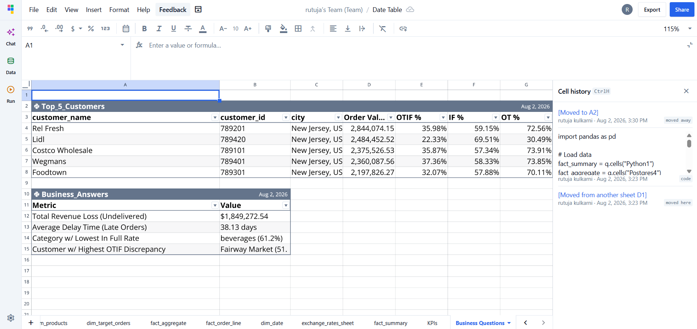
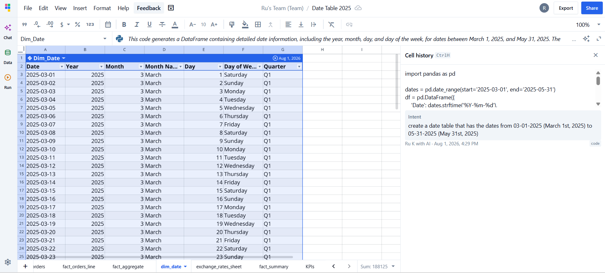
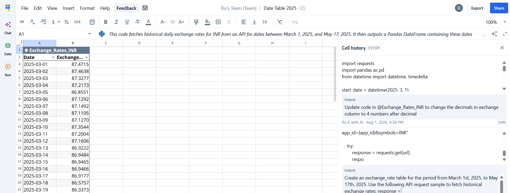
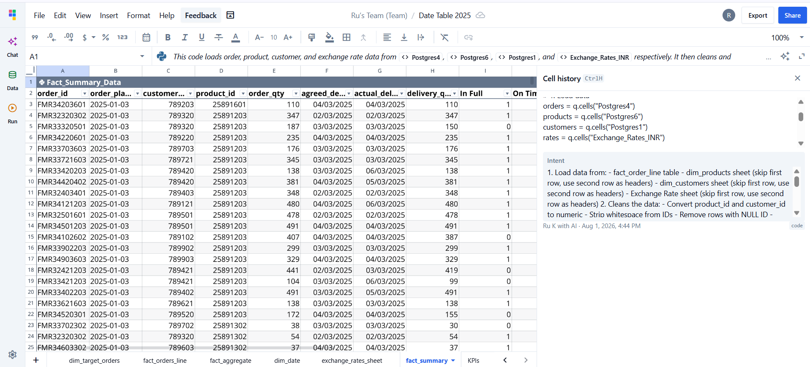
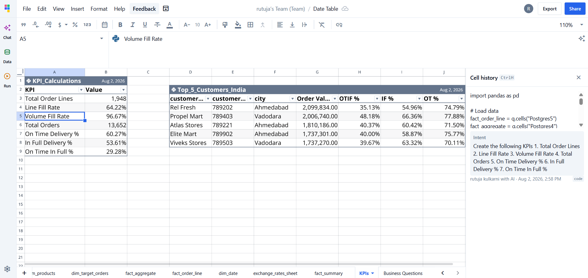
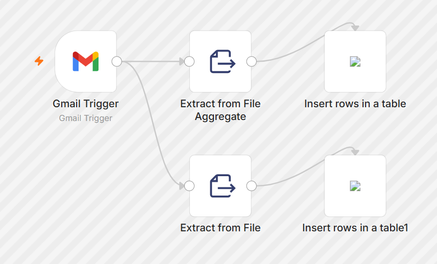

# End-to-End Supply Chain Analytics Automation | Quadratic + n8n + PostgreSQL

## 📌 Project Overview

This project demonstrates an end-to-end supply chain analytics workflow using **PostgreSQL, Quadratic, and n8n**.

The project focuses on preparing supply chain data, performing analysis in Quadratic, creating KPI summaries, and automating the data workflow using n8n.

## 🛠️ Tools & Technologies

- **PostgreSQL** – Data storage and SQL-based data extraction
- **Quadratic** – Data preparation, analysis, calculations, and KPI generation
- **n8n** – Workflow automation
- **Python / Spreadsheet-based analysis** – Data manipulation and calculations

## 🎯 Business Questions

The analysis was structured around key supply chain business questions, including:

- How is the supply chain performing?
- What are the important supply chain KPIs?
- How do costs and sales vary over time?
- How can exchange-rate information be incorporated into the analysis?
- What insights can be derived from the available supply chain data?



## 🔄 Data Preparation & Analysis

### Date Table

Created and used a dedicated date table to support time-based analysis and organize the data around relevant dates.



### Exchange Rate Data

Incorporated exchange-rate information as part of the data preparation and analysis process.



### Fact Summary

Created a summarized view of the fact data to support further analysis and KPI calculations.



## 📊 KPIs

Calculated and analyzed key supply chain performance indicators to summarize business performance and support decision-making.



## ⚙️ Workflow Automation with n8n

Used **n8n** to create an automated workflow connecting the different stages of the data process.



## 🔍 Project Workflow

```text
PostgreSQL
     ↓
Data Extraction
     ↓
Data Preparation
     ↓
Quadratic Analysis
     ↓
KPI Calculation
     ↓
Business Insights
     ↓
n8n Automation
